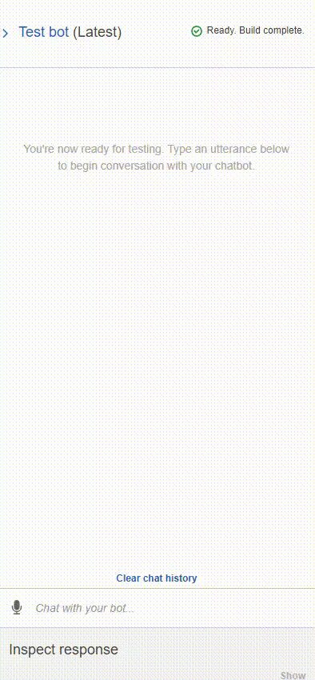

# RoboAdvisor - The Power of the Cloud 

### Robo Advisor for Retirement Plans

*Photo by [Alex Knight](https://www.pexels.com/@alex-knight-1272316?utm_content=attributionCopyText&utm_medium=referral&utm_source=pexels) from [Pexels](https://www.pexels.com/photo/high-angle-photo-of-robot-2599244/?utm_content=attributionCopyText&utm_medium=referral&utm_source=pexels) | [Free License](https://www.pexels.com/photo-license/)*

### Background

Digital transformation consultant, hired by most prominent retirment plan providers in the country would like to increase their client portfolio, especially by engaging young people. Since machine learning and NLP are disrupting finance to improve customer experience, robo advisor is created that could be used by customers or potential new customers to get investment portfolio recommendations for retirement.

### Packages Used:

* Amazon Lex [Amazon Lex Bot](https://aws.amazon.com/lex/)
* Lambda [Amazon Lambda](https://aws.amazon.com/lambda/)

### Files

* [lambda_function.py](Starter_Files/lambda_function.py)
* [correct_dialog.txt](Test_Cases/correct_dialog.txt)
* [age_error.txt](Test_Cases/age_error.txt)
* [incorrect_amount_error.txt](Test_Cases/incorrect_amount_error.txt)
* [negative_age_error.txt](Test_Cases/negative_age_error.txt)

---

#### Tasks Performed:

Initial Robo Advisor Configuration

 1. Define an Amazon Lex Bot with a single intent that establishes a conversation about the requirements to suggest an investment portfolio for retirement 

 2. Sign in into AWS Management Console and create a new custom Amazon Lex bot `RoboAdvisor`. 

 3. Setup the following parameters: 
* **Bot name:** RoboAdvisor
* **Output voice**: Salli
* **Session timeout:** 5 minutes
* **Sentiment analysis:** No
* **COPPA**: No

 4. Create the `RecommendPortfolio` intent, and configure some sample utterances as follows:  
* I want to save money for my retirement
* I'm ​`{age}​` and I would like to invest for my retirement
* I'm `​{age}​` and I want to invest for my retirement
* I want the best option to invest for my retirement
* I'm worried about my retirement
* I want to invest for my retirement
* I would like to invest for my retirement

  

 5. Slots used by the bot, three using built-in types and one custom slot named `riskLevel`. The three initial slots as follows: 

| Name             | Slot Type            | Prompt                                                                    |
| ---------------- | -------------------- | ------------------------------------------------------------------------- |
| firstName        | AMAZON.US_FIRST_NAME | Thank you for trusting on me to help, could you please give me your name? |
| age              | AMAZON.NUMBER        | How old are you?                                                          |
| investmentAmount | AMAZON.NUMBER        | How much do you want to invest?                                           |

    The `riskLevel` custom slot will be used to retrieve the risk level the user is willing to take on the investment portfolio; create this custom slot as follows: 

   > * **Name:** riskLevel
   > * **Prompt:** What level of investment risk would you like to take?
   > * **Maximum number of retries:** 2
   > * **Prompt response cards:** 4

 Configure the response cards for the `riskLevel` slot as is shown bellow: 

| Card 1                              | Card 2                              |
| ----------------------------------- | ----------------------------------- |
|   |   |

| Card 3                              | Card 4                              |
| ----------------------------------- | ----------------------------------- |
|   |   |

 6. Move to the *Confirmation Prompt* section, and set the following messages: 
   * **Confirm:** Thanks, now I will look for the best investment portfolio for you.
   * **Cancel:** I will be pleased to assist you in the future.

 7. Leave the error handling configuration for the `RecommendPortfolio` bot with the default values. 

Build and Test the Robo Advisor

 Build the bot and test it in the chatbot window to ensure accurate user conversation. 

Enhance the Robo Advisor with an Amazon Lambda Function

 1. Create an Amazon Lambda function `recommend_portfolio()` to validate the data provided by the user on the RoboAdvisor. 

 2. Starter code provided on [lambda_function.py](Starter_Files/lambda_function.py) 
    
 3. User input Validation guidelines to complete `recommend_portfolio()` 
* The `age` should be greater than 21 and less than 65.
* the `investment_amount` should be equal to or greater than 5000.

 4. Investment Portfolio Recommendation based on the selected risk level criteria, response from the bot should be as: 
* **none:** "100% bonds (AGG), 0% equities (SPY)"
* **very low:** "80% bonds (AGG), 20% equities (SPY)"
* **low:** "60% bonds (AGG), 40% equities (SPY)"
* **medium:** "40% bonds (AGG), 60% equities (SPY)"
* **high:** "20% bonds (AGG), 80% equities (SPY)"
* **very high:** "0% bonds (AGG), 100% equities (SPY)"

 5. Test the Lambda function using the [sample test cases](Test_Cases/) provided. 

 6. Open the Amazon Lex Console and navigate to the `RecommendPortfolio` bot configuration, integrate the lambda function `recommend_portfolio()` by selecting it in the _Lambda initialization and validation_ and _Fulfillment_ sections. 

Integrate the Amazon Lex with Slack

Follow the guidelines for integrating the Bot with Slack [Integration with Slack](https://docs.aws.amazon.com/lex/latest/dg/slack-bot-association.html)

---

